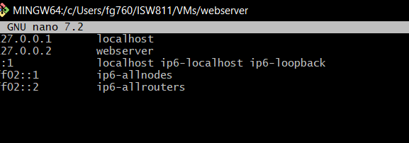
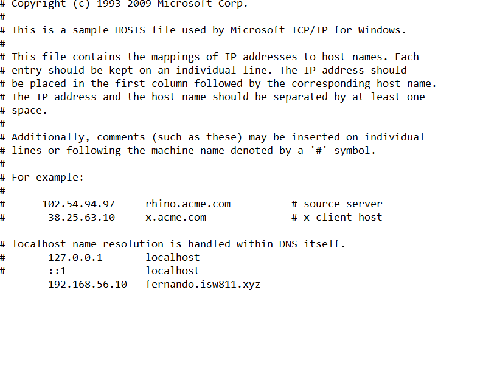
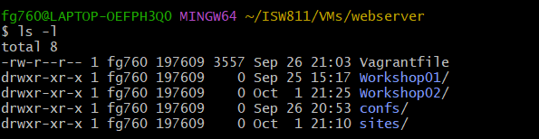
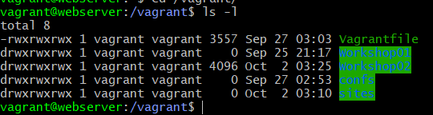
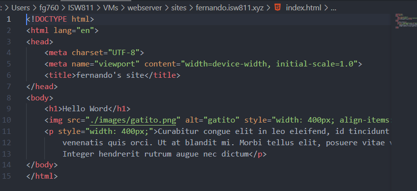
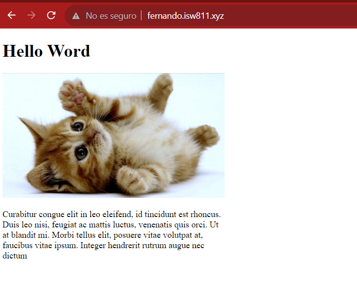

**Fernando José González Rojas**             **02/10/2023**

# Workshop2 - LAMP en Bookworm  
 --- 
## Objetivo del Workshop2
El Fin de este Workshop es mostrar la instalación de las herramientas que serán utilizadas para el desarrollo de aplicaciones web de software libre  
### Primeros Pasos
>Antes de aplicar el siguiente comando verifique encontrase en la carpeta y maquina respectiva en la que quiere implementar LAMP .

## Cambiar el Hostname de la maquina Debian/Boockworm
```bash
    sudo hostnamectl set-hostname
```
continuando con el cambio de nombre de host de la maquina Debian, se debe modificar el archivo hosts, el cual se encuentra en la ruta<span style="color:brown;"> /etc/hosts</span> y agregar el nombre respectivo 
```bash
    nano /etc/hosts
```

>Este paso lo puedes realizar con tu editor de texto favorito, en este caso se utilizara nano, recuerda de los archivos internos y externos, si prefieres puedes descargar el más cómodo a tu parecer.

 **Para**  ver los cambios se debe salir y volver a conectarse a vagrant para refrescar

**Con los comandos**
```bash
    vangrant halt 
    vagrant ssh
``` 

Seguidamente a la hora de la conexión, ya estará el cambio de nombre listo por lo que se debe de actualizar todas las aplicaciones del sistema.
**Con el  comando**
```bash 
sudo apt-get update
```
Una vez actualizado el sistema, se puede proceder a instalar las aplicaciones que componen el ambiente de trabajo LAMP, las cuales son:**Apache2**,**MYSQL**,**PHP** yt algunas otras herramientas funcionales como: **Vim** un editor de texto externo, Maria  DB, cliente y servidor y mcrypt como encriptado de credenciales.
>Con el siguiente comando 

```bash
    sudo apt-get install vim vim-nox curl apache2 mariadb-server mariadb-client php8.2 php8.2-curl php8.2-bcmath php8.2-mysql php8.2-mcrypt php8.2-xml php8.2.zip php8.2-mbstring
```

### Editar el hostfile anfritrion

dependiendo de tu tipo debes de editar tu hostfile esto con el fin de habilitar la dirección ip que utilizara tu sitio web, es decir darle una salida al interprete virtual 

#### Si tienes un sistema operativo windows utiliza:
```cmd 
cd drivers 
cd etc
notepad  hosts
```
### Ejemplo Windows

>Recuerda ingresar como administrador a la te4minal ya que de lo contrario no podrás ejecutar el comando anterior
#### Si tienes un sistema operativo GNU/Linux utiliza el comando anteriormente utilizado para el ambiente virtual:
```bash
sudo cd /etc/hosts
```
### Ejemplo Gnu/Linux


después de la edición de el archivo hosts, este deberá de  solucionar a través del nombre de dominio. 

Esto lo podemos **comprobar** con el siguiente comando:

```bash
ping nombre-dominio
```

## Habilitar los módulos del servidor

Con el fin d utilizar apache como proxy reverso y hospedar varios sitios web en nuestro servidor, se necesita instalar vhost y rewrite y luego reiniciar.
##### No olvidemos el concepto
>**Proxy Reverso:** Un proxy inverso es un tipo de servidor proxy que recupera recursos en nombre de un cliente externo, desde uno o más servidores internos. Estos recursos se devuelven al cliente como si se originaran en el propio servidor
```bash 
sudo a2endmod vhost_alias rewrite ssl 
sudo systemctl restart apache2
``` 

## Confiuracion del vagrantfile para hospedar varios sites 
Desde la maquina anfitriona se debe editar el vagrant file, para mapear el folder a la ruta /home/vagrant/sites en la maquina virtual apache.
#### El vagrant file quedaría:

**En la maquina anfitriona** en la ubicación respectiva, vamos a crear la carpeta que alojara todos los sitios web del servidor
```bash
mkdir sites
```

**Volvemos a levantar la máquina virtual y hacemos la respectiva conexión**

```bash
vagrant up 
vagrant ssh 
```
##### Confimar la existencia de la carpeta 
>Se le debe de verificar la existencia de dicha carpeta ya que en esta se alojarán todos los sitios web que tendrá el servidor. Par confirmar la existencia se pueden utilizar los siguientes **comandos**.
```bash
ls 
ls -l
ls -la
```

##### El montaje de las dos carpetas debería de ver se dé la siguiente manera en las dos rutas.

**/sites**



**/home/vagrant**



## Configuracion del primer vhost desde la maquina anfitriona
Desde la carpeta web se deben de ejecutar los siguientes comandos 

```bash
mkdir confs
```
>Se debe crear la carpeta confs, ya que acá se alojara el archivo conf de cada site creado, el cual se debe configurar sus respectivos datos como: **puerto,index y directorio**.

```bash
cd confs
touch fernando.isw811.xyz.conf
code fernando.isw811.xyz.conf
```
>Nos ubicamos en la carpeta confs, para crear un archivo en blanco y procederlo a abrir con code y agregar el contenido de configuración, asignado por el docente.

El siguiente paso es ubicarse en ruta <span style="color:brown;"> /vagrant/confs</span> la máquina virtual, con los comandos.
```bash
cd /vagrant
cd confs
```
## Habilitar el sitio web

Como primer paso para habilitar el sitio web se debe de copiar el archivo de configuración respectivo del sitio y pegarlo en la carpeta de sitos habilitados de apache, con el siguiente comando.

```bash 
sudo cp fernando.iws811.xyz.conf /etc/apache2/sites-available/
```
seguidamente se habilitar el sitio
```bash
sudo a2ensite mizaq.isw811.xyz.conf
```
y si deseas deshabilitar por alguna razón
```bash
sudo a2disite mizaq.isw811.xyz.conf
```
 para verificar salud de la configuración el website se debe ejecutar el siguiente comando 
```bash
sudo apache2ctl -t
```
#### Pero si no deseas ver errores primero agrega el server name 
```bash
echo "ServerName webserver" | sudo tee -a /etc/apache2/apache2.conf
```
este comando es para agregar el servername y el webserver  y el -a valida el apend, si no se llega a agregar se  sobre escribe todo el archivo.

Antes de refrescar apache2  y no tener errores, se debe de crear la carpeta y el index del respectivo sitio en la maquina anfitriona. con los comandos:
```bash
cd sites
mkdir fernando.isw811.xyz
cd fernando.isw811.xyz
touch index.html
code index.html
```

Para agregar algunas imágenes al sitio
```bash
mkdir images
```
#### Ahora se puede refrecar el apache desde la máquina virtual 
```bash
sudo systemctl reload apache2 para recargar
```

### Para terminar se agrega algun contenido al index.html y severia algo asi



