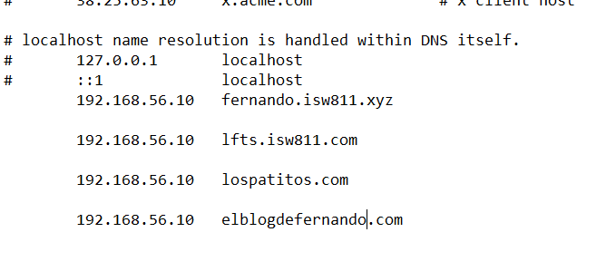
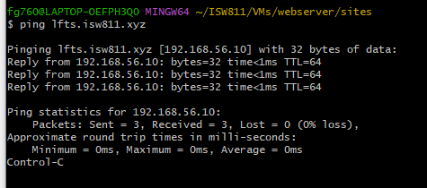

 **Fernando José González Rojas**             **010/10/2023**

# Workshop3 - Laravel en Bookworm  
 --- 
## Objetivo del Workshop3
El Fin de este Workshop es crear tres sitios web que se utilizaran como práctica, uno de estos sitios se reemplazara por un proyecto default de laravel, que previamente se descargara en la maquina Bookworm
## Primeros Pasos
 
 ### Primero se deben de agregar los tres hosts en la maquina anfitriona.
#### Si estas en un dispositivo Windows recuerda hacerlo en la ruta 


---
 
 ##### Se verifican los hosts con ping y respondan a la misma ip
 
## Copiar y modificar los hosts
 ##### Vamos a ubicarnos en la ruta 
 ```bash
  ~cd /ISW811/VMs/webserver
 ```
  ##### se copian el archivo de vhost.confs previamente creado, para crear los diferentes vhost que vamos a utilizar


#### Se reemplazan los datos de los archivos.conf con las dos siguientes maneras 

##### Editando a travez de code 

##### o

##### recordando que se debe escapar el punto y cualquiera de las dos barras igualmente y cat para ver el archivo editado

### Rellenar páginas web 
##### se crea el contenido de todas las páginas web y el public para los assets 


##### Se copian  los archivos de configuración vhost desde la máquina virtual para colocarlos en los sites avileble de apache 2


#### Se utiliza la forma rápida o uno por uno. Recordando el contexto con la ruta espesifica desde donde se copia y adónde van ya que podemos llenar carpetas de basura 
```bash
cp ruta * /etc/apache2/sites-available/
```
 ## Se habilitan los sitios
 ### Descarga de composer 
>Con el siguiente comando se procede a descargar composer para la maquina Bookworm
```bash
php -r "copy('https://getcomposer.org/installer', 'composer-setup.php');"
```
Este comando se encarga de la descarga del componser setup

```bash
php composer-setup.php
```
El comando anterior compila y crea un phar binario

### Se remueve el setup descargado para no alojar basura en nuestra maquina
```bash
rm composer-setup.php
```

#### Se crea la carpeta para el phar
```bash
sudo mkdir -p /opt/composer/
```

movemos composer
```bash
sudo mv composer.phar /opt/composer/
```

```bash
sudo ln -s /opt/composer/composer.phar /usr/bin/composer
```

### Nos ubicamos en la carpeta de sites para proceder a remover el sitio de prueba por el sitio Laravel
```bash 

cd /vagrant/sites
rm -r lfts.isw811.xyz
```
 ### se crea el proyecto 
 ```bash
 composer create-project laravel/laravel:8.6.12 lfts.isw811.xyz
 ```

  >Se procede a editar el vhost de la ltfs para que el framwork pueda funcionar el puerto indicado, esto en la ruta **cd webserver/confs**!
  

 
## Visualización del proyecto Laravel 
Como resultado final se tendrá la página por defecto de laravel, en mi caso no puede solucionar el error y me muestra el index.php del proyecto generado por el composer 

## Evidencia en Código
```php

    <?php use Illuminate\Contracts\Http\Kernel; use Illuminate\Http\Request; define('LARAVEL_START', microtime(true)); /* |-------------------------------------------------------------------------- | Check If The Application Is Under Maintenance |-------------------------------------------------------------------------- | | If the application is in maintenance / demo mode via the "down" command | we will load this file so that any pre-rendered content can be shown | instead of starting the framework, which could cause an exception. | */ if (file_exists($maintenance = __DIR__.'/../storage/framework/maintenance.php')) { require $maintenance; } /* |-------------------------------------------------------------------------- | Register The Auto Loader |-------------------------------------------------------------------------- | | Composer provides a convenient, automatically generated class loader for | this application. We just need to utilize it! We'll simply require it | into the script here so we don't need to manually load our classes. | */ require __DIR__.'/../vendor/autoload.php'; /* |-------------------------------------------------------------------------- | Run The Application |-------------------------------------------------------------------------- | | Once we have the application, we can handle the incoming request using | the application's HTTP kernel. Then, we will send the response back | to this client's browser, allowing them to enjoy our application. | */ $app = require_once __DIR__.'/../bootstrap/app.php'; $kernel = $app->make(Kernel::class); $response = $kernel->handle( $request = Request::capture() )->send(); $kernel->terminate($request, $response);
```
## Evidencia desde el navegador


